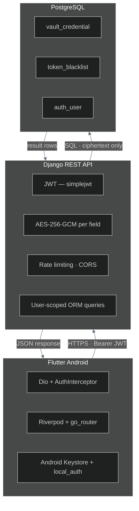

# Password Vault

A full-stack mobile application for secure credential management. The Android client is built with Flutter; the backend is a Django REST API backed by PostgreSQL. Credential fields are encrypted with AES-256-GCM at the application layer — the database stores only ciphertext.

---

## Architecture



---

## Tech Stack

| Layer | Technology | Version |
|---|---|---|
| Mobile UI | Flutter (Android) | ≥ 3.10.0 |
| State management | flutter_riverpod | ^3.3.1 |
| Navigation | go_router | ^17.2.2 |
| HTTP client | Dio | ^5.4.0 |
| Token storage | flutter_secure_storage (Android Keystore) | ^10.0.0 |
| Biometrics | local_auth | ^3.0.1 |
| Backend framework | Django + Django REST Framework | 4.2 LTS / 3.14 |
| Authentication | djangorestframework-simplejwt | 5.3.1 |
| Encryption | Python cryptography — AES-256-GCM | 42.0.8 |
| Database | PostgreSQL | ≥ 14 |
| Rate limiting | django-ratelimit | 4.1.0 |
| CORS | django-cors-headers | 4.3.1 |
| Config management | python-decouple | 3.8 |

---

## Project Structure

**Backend** (`backend/`)

| Path | Purpose |
|---|---|
| `config/settings.py` | Django settings — database, JWT lifetimes, CORS, rate limiting |
| `config/urls.py` | Root URL dispatcher |
| `apps/authentication/` | Register, login, logout, token refresh, password change |
| `apps/vault/` | Category and credential CRUD; AES-256-GCM encryption |
| `apps/users/` | Profile retrieval and account deletion |

**Mobile** (`mobile/lib/`)

| Path | Purpose |
|---|---|
| `main.dart` | Entry point; app lifecycle observer for auto-lock |
| `core/network/` | Dio client and AuthInterceptor — JWT injection and silent refresh |
| `core/router/` | go_router configuration — auth and lock route guards |
| `core/biometrics/` | BiometricService wrapping local_auth |
| `core/theme/` | Light and dark themes |
| `features/auth/` | Login, Register, Lock screens |
| `features/vault/` | Vault list, credential detail, credential form |
| `features/generator/` | Password generator |
| `features/settings/` | Theme toggle, biometric toggle, account management |

---

## API Reference

All authenticated endpoints require `Authorization: Bearer <access_token>`.

### Authentication

| Method | Endpoint | Auth | Description |
|---|---|---|---|
| POST | `/api/auth/register/` | No | Create a new user account |
| POST | `/api/auth/login/` | No | Authenticate and receive a JWT token pair |
| POST | `/api/auth/logout/` | Yes | Blacklist the provided refresh token |
| POST | `/api/auth/token/refresh/` | No | Exchange a refresh token for a new access token |
| POST | `/api/auth/change-password/` | Yes | Change the authenticated user's password |

### Users

| Method | Endpoint | Auth | Description |
|---|---|---|---|
| GET | `/api/users/profile/` | Yes | Retrieve the authenticated user's profile |
| DELETE | `/api/users/delete/` | Yes | Permanently delete the account and all associated data |

### Vault

| Method | Endpoint | Auth | Description |
|---|---|---|---|
| GET | `/api/vault/categories/` | Yes | List all categories for the authenticated user |
| POST | `/api/vault/categories/` | Yes | Create a category |
| PUT | `/api/vault/categories/{id}/` | Yes | Rename a category |
| DELETE | `/api/vault/categories/{id}/` | Yes | Delete a category |
| GET | `/api/vault/credentials/` | Yes | List credentials — supports `?category=<id>` and `?q=<search>` |
| POST | `/api/vault/credentials/` | Yes | Create a credential |
| GET | `/api/vault/credentials/{id}/` | Yes | Retrieve a single credential |
| PUT | `/api/vault/credentials/{id}/` | Yes | Update a credential |
| DELETE | `/api/vault/credentials/{id}/` | Yes | Delete a credential |

Write fields use the `_input` suffix (e.g. `password_input`); read fields return decrypted values under plain names (e.g. `password`).

---

## Setup

### Prerequisites

- Python ≥ 3.11
- PostgreSQL ≥ 14
- Flutter SDK ≥ 3.10.0
- Android emulator (API 34+) or physical device (API 23+)

### Backend

**1. Install dependencies**
```bash
cd backend
pip install -r requirements.txt
```

**2. Configure environment**
```bash
cp .env.example .env
```
Generate the AES key and paste it into `AES_ENCRYPTION_KEY` in `.env`:
```bash
python -c "import os, base64; print(base64.b64encode(os.urandom(32)).decode())"
```

**3. Create the database**

Open pgAdmin or psql and run:
```sql
CREATE DATABASE password_vault;
```

**4. Apply migrations**
```bash
python manage.py migrate
```

**5. Start the server**
```bash
python manage.py runserver
```

API available at `http://localhost:8000/api/`.

### Mobile

```bash
cd mobile
flutter pub get
flutter run            # emulator must be running; .env is pre-configured for 10.0.2.2
```

---

## Security

| Concern | Implementation |
|---|---|
| Encryption at rest | AES-256-GCM per field; unique 12-byte nonce per encryption; stored as `base64(nonce ‖ ciphertext ‖ GCM tag)` |
| Authentication | JWT — 60 min access token; 7-day refresh token rotated on every use; blacklisted on logout |
| Rate limiting | Register and login endpoints limited to 5 requests/min per IP |
| Token storage | `flutter_secure_storage` → Android Keystore (hardware-backed on supported devices) |
| Biometric lock | Vault locks after `AUTO_LOCK_TIMEOUT` seconds in background; unlocks via `BiometricPrompt` |
| Clipboard | Copied passwords cleared after `CLIPBOARD_CLEAR_DELAY` seconds (default 30) |
| Data isolation | Every query filtered by `request.user` — no cross-user access possible |

---

## Data Models

**Category**

| Field | Type | Notes |
|---|---|---|
| `user` | FK → User | Owner |
| `name` | CharField | Unique per user |
| `created_at`, `updated_at` | DateTimeField | Auto-managed |

**Credential**

| Field | Type | Notes |
|---|---|---|
| `user` | FK → User | Owner |
| `category` | FK → Category | Optional |
| `title` | CharField | Plaintext label |
| `username` | TextField | AES-256-GCM encrypted |
| `password` | TextField | AES-256-GCM encrypted |
| `url` | TextField | AES-256-GCM encrypted |
| `notes` | TextField | AES-256-GCM encrypted |
| `created_at`, `updated_at` | DateTimeField | Auto-managed |

---

## Environment Variables

### Backend `.env`

| Variable | Description |
|---|---|
| `SECRET_KEY` | Django secret key |
| `DEBUG` | Enable debug mode (`True` / `False`) |
| `ALLOWED_HOSTS` | Comma-separated list of allowed hostnames |
| `DB_NAME` | PostgreSQL database name |
| `DB_USER` | PostgreSQL user |
| `DB_PASSWORD` | PostgreSQL password |
| `DB_HOST` | PostgreSQL host |
| `DB_PORT` | PostgreSQL port |
| `AES_ENCRYPTION_KEY` | Base64-encoded 32-byte AES key |
| `JWT_ACCESS_TOKEN_LIFETIME_MINUTES` | Access token TTL (minutes) |
| `JWT_REFRESH_TOKEN_LIFETIME_DAYS` | Refresh token TTL (days) |
| `CORS_ALLOWED_ORIGINS` | Comma-separated allowed CORS origins |

### Mobile `.env`

| Variable | Description |
|---|---|
| `API_BASE_URL` | Backend API base URL |
| `CLIPBOARD_CLEAR_DELAY` | Seconds before clipboard is cleared |
| `AUTO_LOCK_TIMEOUT` | Seconds of background time before vault locks |
